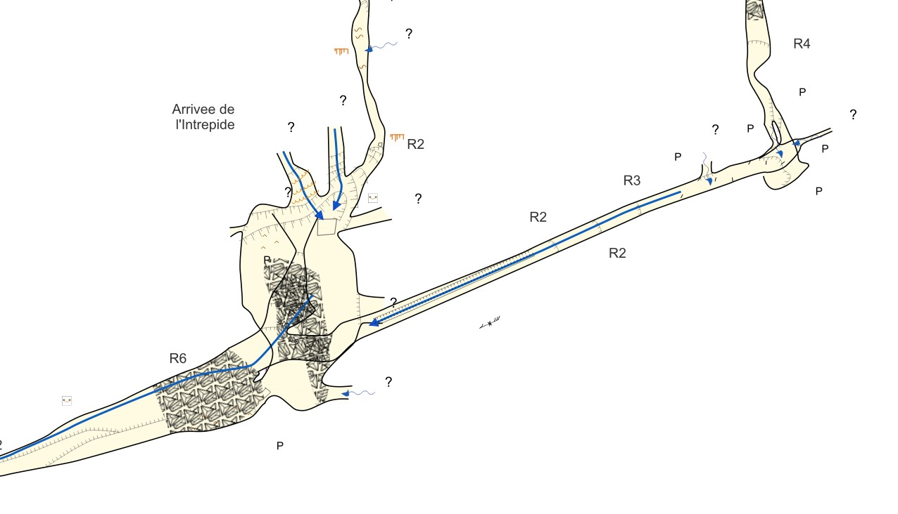
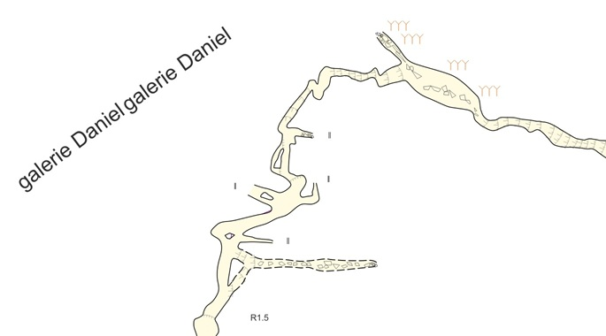

QGis Collection for Therion survey
==================================

🇫🇷 [Lire en Français](./README.md)

This repository contains QGis layer definitions and SVG symbols for visualizing Therion survey in QGis.

The set is based on the standard UIS symbols.

For more details, models, and scripts are available at https://github.com/robertxa/Topographies-Samoens_Folly.

Description
-----------

QGis screenshot,


  


Usage
-----

Creating .shp files with Therion:  
`export map -proj plan -fmt esri -o Outputs/SHP/ -layout my_layout -enc UTF-8`

Conversion using the Python script :  
[CleanShp2d.py](https://github.com/robertxa/Topographies-Samoens_Folly/blob/master/Samoens-GIS/Scripts/CleanShp2d.py)

Import the files `outline2d.gpkg`, `lines2dMasked.gpkg`, `areas2dMasked.gpkg`, `points2d.gpkg` into QGIS.

Apply the layer styles from the collection.


Bonus: Inserting Offset Views or Section Views
==============================================

Same method as above. For sections:  
`export map -proj extended -fmt esri -o Outputs/SHP_Extended/ -layout layout-section -enc UTF-8`

Create 4 virtual layers in QGIS with the following query (to be adapted):  
```sql
SELECT 
    ST_Translate(geometry, 180.0, -40.0, 0.0) AS geometry,
    *
FROM 
    outline2d
```

Apply the layer styles from the collection

Filter the layers to select the scraps to be displayed offset


License
-------

All these data are published under the free license 
[Creative Commons CC BY-NC-SA 4.0](https://creativecommons.org/licenses/by-nc-sa/4.0/)


Author
------

Alexandre PONT (alexandre dot pont at yahoo dot fr)
