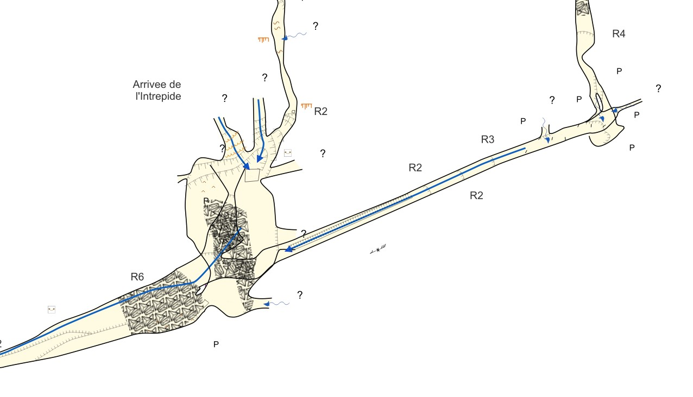
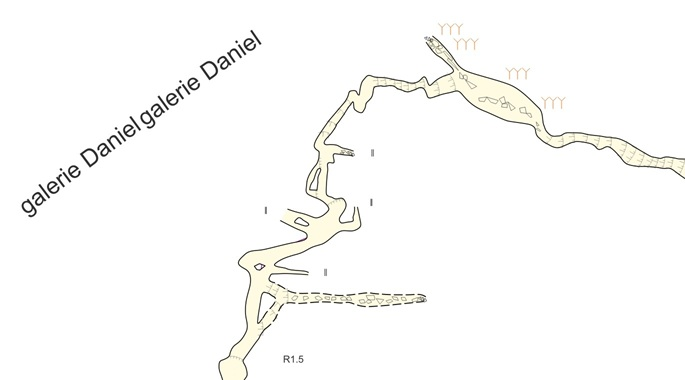

# Collection QGis pour topographies Therion

🇬🇧 [Read in English](./README.en.md)

Ce dépôt contient les définitions de couche QGis et les symboles SVG pour visualiser les topographies Therion sur QGis.

L'ensemble est basé sur les symboles standards de l'UIS

Pour plus de détails, modèles et scripts sont disponibles sur https://github.com/robertxa/Topographies-Samoens_Folly et https://github.com/robertxa/pyThGIS.


## Description

Captures d'écran QGis, 


  



## Usage

Création des fichiers .shp avec Therion : 
`export map -proj plan -fmt esri -o Outputs/SHP/ -layout my_layout -enc UTF-8`

Conversion avec le script python :
[CleanShp2d.py](https://github.com/robertxa/Topographies-Samoens_Folly/blob/master/Samoens-GIS/Scripts/CleanShp2d.py)

Import des fichiers  outline2d.gpkg, lines2dMasekd.gpkg, areas2dMasekd.gpkg, points2d.gpkg dans QGis

Application des styles de couche de la collection


### Bonus : Insertion de vue décalé ou de vue en coupe

Même methode que ci dessus, pour les coupes : 
`export map -proj extended -fmt esri -o Outputs/SHP_Extended/ -layout layout-coupe -enc UTF-8`

Création de 4 couches virtuelles dans QGis avec la requête (à adapter): 
```sql
SELECT 
    ST_Translate(geometry, 180.0, -40.0, 0.0) AS geometry,
    *
FROM 
    outline2d
```

Application des styles de couche de la collection

Filtrage des couches pour sélectionner les scraps à afficher décalé


## Licence

L'ensemble de ces données est publié sous la licence libre 
[Creative Commons CC BY-NC-SA 4.0](https://creativecommons.org/licenses/by-nc-sa/4.0/)


## Auteur

Alexandre PONT (alexandre dot pont at yahoo dot fr )

